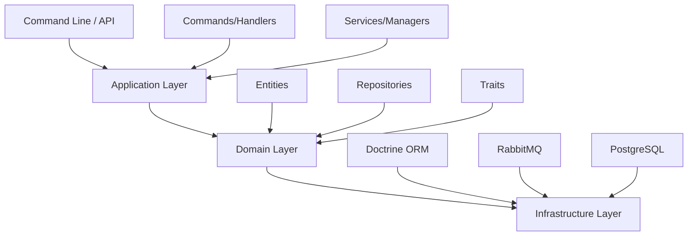

# 🏗️ ARCHITECTURE.md

## 🎯 Vue d'ensemble

Ce projet implémente un système de gestion de contacts performant, conçu pour traiter de **gros volumes de données** (1.5M+ lignes) avec une architecture moderne basée sur **DDD** et **CQRS**.

### Problématiques résolues
- ✅ **Gestion mémoire** optimisée pour les imports massifs
- ✅ **Traitement asynchrone** avec RabbitMQ
- ✅ **Architecture scalable** et maintenable
- ✅ **Performance** améliorée avec le chunking

---

## 🗂️ Structure du Projet

Basée sur la capture d'écran fournie :

```
src/
├── Application/
│   ├── Common/
│   │   └── Doctrine/
│   │       └── DoctrineResetTrait.php
│   │   └── Handler/
│   │       └── ProcessChunkMessageHandler.php
│   │   └── Message/
│   │       └── ProcessChunkMessage.php
│   ├── Contact/
│   │   ├── Handler/
│   │   │   └── DeleteOldContactsHandler.php
│   │   ├── Message/
│   │   │   └── DeleteOldContactsMessage.php
│   │   └── Service/
│   │       └── ContactManager.php
│   ├── ContactOrganization/
│   │   └── Service/
│   │       └── ContactOrganizationManager.php
│   └── Organization/
│       └── Service/
│           └── OrganizationManager.php
├── Command/
│   └── UpdateContactCommand.php
├── Controller/
├── Entity/
│   ├── Trait/
│   │   ├── Address.php
│   │   ├── Contact.php
│   │   ├── HashableInterface.php
│   │   └── Organization.php
├── Repository/
│   ├── AddressRepository.php
│   ├── ContactRepository.php
│   ├── ContactRepositoryInterface.php
│   └── OrganizationRepository.php
└── Kernel.php

tests/
├── fixtures/
├── functional/
│   └── Command/
│       └── UpdateContactCommandTest.php
└── unit/
    └── Application/
```

---

## 🧱 Architecture Technique

### Couches d'Architecture



### Flux de Traitement des Données

```
┌─────────────────────┐
│ UpdateContactCommand│
└──────────┬──────────┘
           │
           ▼
┌─────────────────────────────────────┐
│ Découpe CSV en chunks (1000 lignes) │
└──────────────┬──────────────────────┘
               │
               ▼
┌───────────────────────────────────────────────┐
│ ProcessChunkMessage (type: contacts, orgs...) │
└─────────────────────┬─────────────────────────┘
                      │
                      ▼
┌─────────────────────────────────────────────────┐
│ ProcessChunkMessageHandler                      │
│ - Dispatch vers le bon manager                  │
│ - flush + reset EntityManager                   │
│ - gc_collect_cycles()                           │
└─────────────────┬───────────────────────────────┘
                  │
         ┌────────┼────────┐
         ▼        ▼        ▼
┌─────────────┐ ┌──────────────┐ ┌────────────────────┐
│ContactManager│ │Organization  │ │ContactOrganization │
│             │ │Manager       │ │Manager             │
└─────────────┘ └──────────────┘ └────────────────────┘
```

---

## 🔥 Optimisations Mémoire

### Problème Initial
- **1.5M+ lignes** dans le fichier CSV
- **Memory exhausted** après quelques centaines de milliers de lignes
- Doctrine accumulait les entités en mémoire
- Temps d'exécution : ~1h50

### Solutions Implémentées

#### 1. Optimisation Doctrine
```php
// DoctrineResetTrait.php
public function flushAndClear(): void
{
    $this->entityManager->flush();
    $this->entityManager->clear();
    gc_collect_cycles(); // Force garbage collection
}
```

#### 2. Chunking Strategy
```php
// UpdateContactCommand.php
$chunks = array_chunk($data, 1000);
foreach ($chunks as $index => $chunk) {
    $this->messageBus->dispatch(
        new ProcessChunkMessage($chunk, $index, 'contacts')
    );
}
```

#### 3. Message Unifié
```php
// ProcessChunkMessage.php
class ProcessChunkMessage
{
    public function __construct(
        public readonly array $chunk,
        public readonly int $chunkNumber,
        public readonly string $type,
    ) {}
}
```

#### 4. Handler Générique
```php
// ProcessChunkMessageHandler.php
public function __invoke(ProcessChunkMessage $message): void
{
    match ($message->type) {
        'contacts' => $this->contactManager->createOrUpdate($message->chunk),
        'organizations' => $this->organizationManager->createOrUpdate($message->chunk),
        'contact_organizations' => $this->contactOrganizationManager->createOrUpdate($message->chunk),
    };
    
    $this->flushAndClear();
}
```

---

## 🐰 Configuration RabbitMQ

### Transport Configuration
```yaml
# config/packages/messenger.yaml
framework:
    messenger:
        transports:
            async:
                dsn: '%env(MESSENGER_TRANSPORT_DSN)%'
                options:
                    auto_setup: true
                    
        routing:
            App\Application\Common\Message\ProcessChunkMessage: async
```

### Middleware Doctrine
```yaml
buses:
    messenger.bus.default:
        middleware:
            - doctrine_ping_connection
            - doctrine_close_connection
```

---

## 🧪 Tests et Qualité

### Structure des Tests
- **Tests fonctionnels** : Vérifient le comportement end-to-end
- **Tests unitaires** : Testent la logique métier isolée
- **Fixtures** : Données de test cohérentes

### Outils de Qualité
- **PHPStan** niveau 6 pour l'analyse statique
- **PHP-CS-Fixer** pour le style de code
- **PHPUnit** pour les tests

---

## 📊 Métriques de Performance

### Avant Optimisation
- ❌ **Mémoire** : Memory exhausted
- ❌ **Temps** : ~1h50 (si ça finissait)
- ❌ **Parallélisation** : Aucune

### Après Optimisation
- ✅ **Mémoire** : Stable (~50MB par worker)
- ✅ **Temps** : Parallélisable selon le nombre de workers
- ✅ **Scalabilité** : Ajout de workers selon les besoins

---
